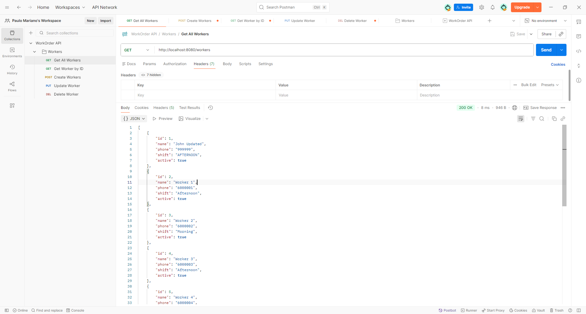

# API Testing

The REST API can be tested using the included Postman collection.

Location:

docs/postman/workorder-api.postman_collection.json

---

# Available Endpoints

| Method | Endpoint      | Description      |
| ------ | ------------- | ---------------- |
| GET    | /workers      | Get all workers  |
| GET    | /workers/{id} | Get worker by id |
| POST   | /workers      | Create worker    |
| PUT    | /workers/{id} | Update worker    |
| DELETE | /workers/{id} | Delete worker    |

---

# GET All Workers

  

---

# GET Worker by ID

  

---

# POST Create Worker

  

---

# PUT Update Worker

  

---

# DELETE Worker

  

