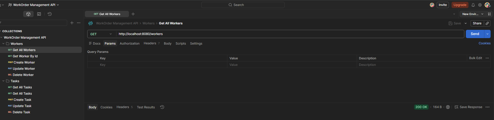
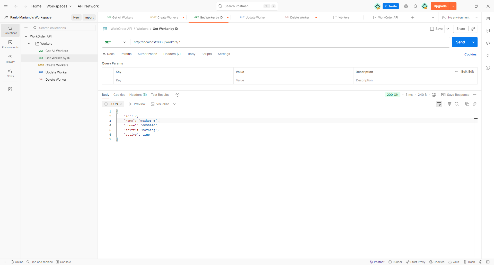
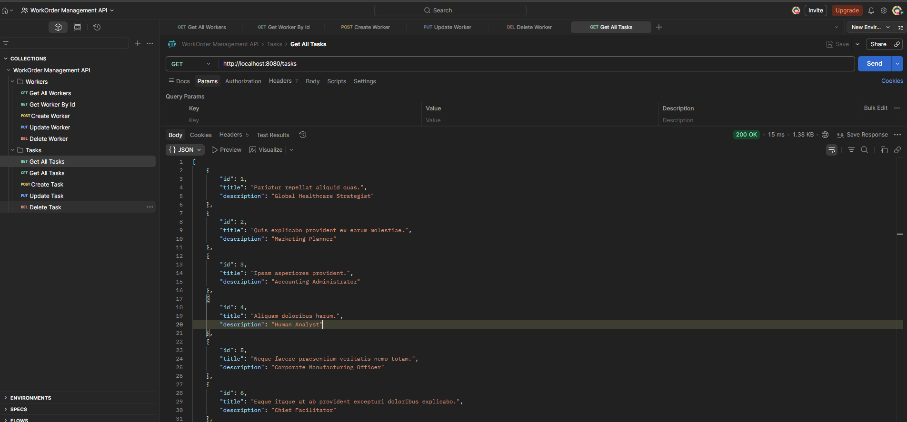
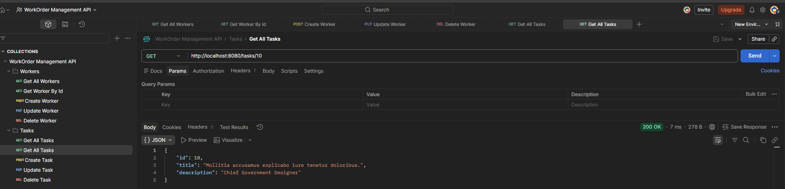
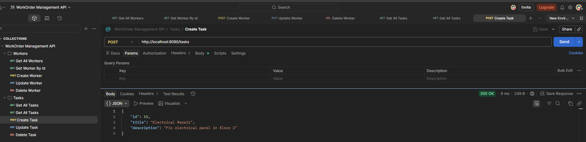
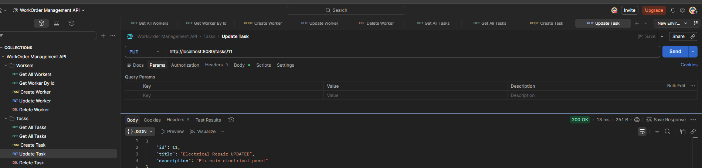
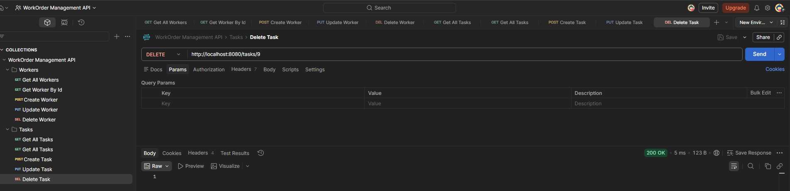

# WorkOrder Management API Testing Guide

This document explains how to test the WorkOrder Management REST API using Postman.

---

## Base URL

```
http://localhost:8080
```

All endpoints described below use this base URL.

---

## Postman Collection

A ready-to-use Postman collection is included in the project.

Location:

```
docs/postman/workorder-api.postman_collection.json
```

Import this file into Postman to quickly test all API endpoints.

---

# Workers API

The Workers API manages workers stored in the system.

| Method | Endpoint | Description |
|------|------|------|
| GET | /workers | Retrieve all workers |
| GET | /workers/{id} | Retrieve a worker by id |
| POST | /workers | Create a new worker |
| PUT | /workers/{id} | Update an existing worker |
| DELETE | /workers/{id} | Delete a worker |

---

## GET /workers

Returns the list of all workers stored in the database.

<p align="center">
  
</p>

---

## GET /workers/{id}

Returns a specific worker by id.

Example:

```
GET /workers/1
```

<p align="center">
  
</p>

---

## POST /workers

Creates a new worker.

Example request body:

```json
{
  "name": "Paulo",
  "phone": "600123456",
  "shift": "MORNING",
  "active": true
}
```

<p align="center">
  
</p>

---

## PUT /workers/{id}

Updates an existing worker.

Example:

```
PUT /workers/1
```

<p align="center">
  
</p>

---

## DELETE /workers/{id}

Deletes a worker by id.

Example:

```
DELETE /workers/1
```

<p align="center">
  
</p>

---

# Tasks API

The Tasks API manages tasks associated with work orders.

| Method | Endpoint | Description |
|------|------|------|
| GET | /tasks | Retrieve all tasks |
| GET | /tasks/{id} | Retrieve task by id |
| POST | /tasks | Create a new task |
| PUT | /tasks/{id} | Update a task |
| DELETE | /tasks/{id} | Delete a task |

---

## GET /tasks

Returns the list of all tasks.

<p align="center">
  
</p>

---

## GET /tasks/{id}

Returns a specific task.

Example:

```
GET /tasks/1
```

<p align="center">
  
</p>

---

## POST /tasks

Creates a new task.

Example request body:

```json
{
  "title": "Cleaning",
  "description": "Clean building"
}
```

<p align="center">
  
</p>

---

## PUT /tasks/{id}

Updates an existing task.

<p align="center">
  
</p>

---

## DELETE /tasks/{id}

Deletes a task.

<p align="center">
  
</p>

---

# Recommended Testing Flow

When testing the API with Postman, follow this order:

1. Create a resource (POST)
2. Retrieve the list (GET)
3. Retrieve by id (GET)
4. Update the resource (PUT)
5. Delete the resource (DELETE)

---

# Summary

The WorkOrder Management API provides REST endpoints for managing:

- Workers
- Tasks

The included Postman collection allows quick testing of all endpoints during development.