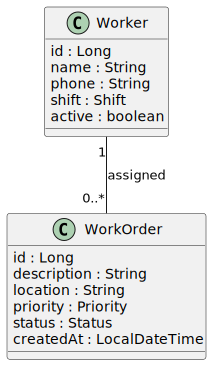

# Architecture V1 – Domain Model

Version 1 represents the initial design of the system.

This version focuses on defining the **core domain model** and documenting the structure of the main entity.

---

# System Architecture

  

---

# Domain Layer

The first version of the system defines the **core entity** of the application.

## Worker

The Worker entity represents a person responsible for performing work orders.

Attributes:

| Field  | Type    |
| ------ | ------- |
| id     | Long    |
| name   | String  |
| phone  | String  |
| shift  | String  |
| active | boolean |

---

# Purpose of Version 1

This version establishes the foundation of the backend system by:

- Defining the main domain entity
- Designing the domain model using UML
- Preparing the project structure for future backend layers

This model will be expanded in future versions with additional entities and relationships.
