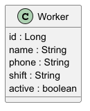

# Architecture v1 – Domain Model

Version 1 represents the initial design of the system.

This version focuses on defining the core domain model and documenting the structure of the main entity.

---

## System Architecture

The architecture in version 1 is limited to the **domain layer**, where the main entity of the system is defined.

This layer represents the business model of the application and serves as the foundation for future backend components such as services, repositories, and controllers.

---

## Domain Layer

The first version of the system defines the core entity of the application.

### Worker

The `Worker` entity represents a worker in the system.

| Field  | Type    |
| ------ | ------- |
| id     | Long    |
| name   | String  |
| phone  | String  |
| shift  | String  |
| active | boolean |

---

## Domain Model Diagram

The following UML diagram represents the domain model of version 1.

---

# Purpose of Version 1

This version establishes the foundation of the backend system by:

- Defining the main domain entity
- Designing the domain model using UML
- Preparing the project structure for future backend layers

This model will be expanded in future versions with additional entities and relationships.
