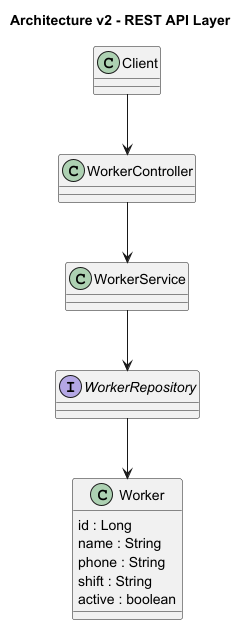

# Architecture v2 – REST API Layer

Version 2 introduces the REST API layer to expose the Worker entity through HTTP endpoints.

This version adds the backend layers required to handle client requests.

---

## Architectural Layers

The application follows a typical Spring Boot layered architecture.

| Layer      | Responsibility              |
| ---------- | --------------------------- |
| Controller | Handles HTTP requests       |
| Service    | Contains business logic     |
| Repository | Handles database operations |
| Entity     | Represents the domain model |

---

---

## Architecture Diagram

The following diagram shows the layered architecture introduced in version 2.

---

## Request Flow

Client requests follow this path:

Client → Controller → Service → Repository → Database

---

## Worker REST Endpoints

The following endpoints are available:

| Method | Endpoint      | Description           |
| ------ | ------------- | --------------------- |
| GET    | /workers      | Retrieve all workers  |
| GET    | /workers/{id} | Retrieve worker by id |
| POST   | /workers      | Create worker         |
| PUT    | /workers/{id} | Update worker         |
| DELETE | /workers/{id} | Delete worker         |

---

## Purpose of Version 2

Version 2 extends the system by:

- Introducing the REST API
- Adding Controller, Service, and Repository layers
- Allowing external clients to interact with the system through HTTP endpoints
