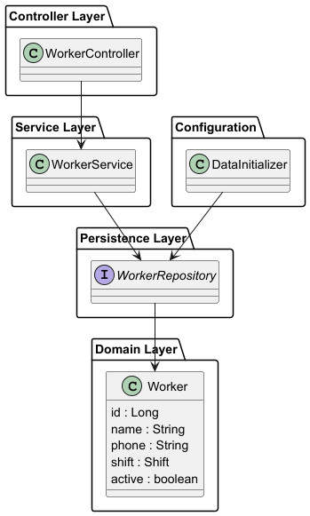

@startuml

package "Controller Layer" {
 class WorkerController
}

package "Service Layer" {
 class WorkerService
}

package "Persistence Layer" {
 interface WorkerRepository
}

package "Configuration" {
 class DataInitializer
}

package "Domain Layer" {

 class Worker {
  id : Long
  name : String
  phone : String
  shift : Shift
  active : boolean
 }

}

WorkerController --> WorkerService
WorkerService --> WorkerRepository
WorkerRepository --> Worker

DataInitializer --> WorkerRepository

@enduml

## Architecture Diagram

  

