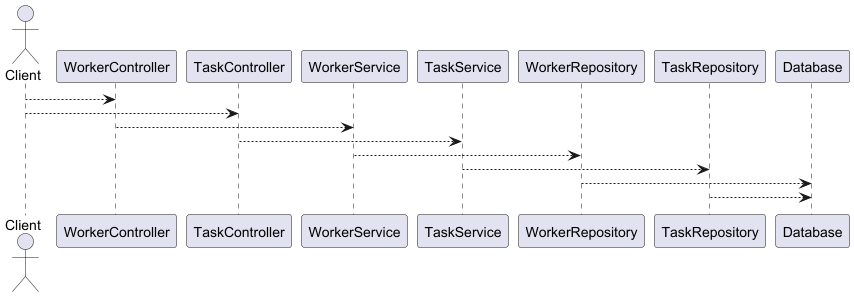
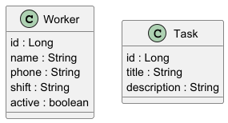

# Architecture v4 – Workers and Tasks

Version 4 extends the domain model by introducing the **Task** entity.

The system can now manage two types of resources:

- Workers
- Tasks

---

## Architecture

The application follows a layered Spring Boot architecture.

Controller → Service → Repository → Database

---

## Domain Model

### Worker

| Field  | Type    |
| ------ | ------- |
| id     | Long    |
| name   | String  |
| phone  | String  |
| shift  | String  |
| active | boolean |

### Task

| Field       | Type   |
| ----------- | ------ |
| id          | Long   |
| title       | String |
| description | String |

---

## Architecture Diagram

The following diagram shows the layered architecture of the system including both Worker and Task APIs.

---

## Domain Model Diagram

The following UML diagram represents the domain model introduced in version 4.

---

## API Endpoints

### Workers

GET /workers  
GET /workers/{id}  
POST /workers  
PUT /workers/{id}  
DELETE /workers/{id}

### Tasks

GET /tasks  
GET /tasks/{id}  
POST /tasks  
PUT /tasks/{id}  
DELETE /tasks/{id}

---

## Purpose of Version 4

This version expands the system by:

- introducing the Task entity
- exposing CRUD endpoints for tasks
- preparing the system for future relationships between entities
